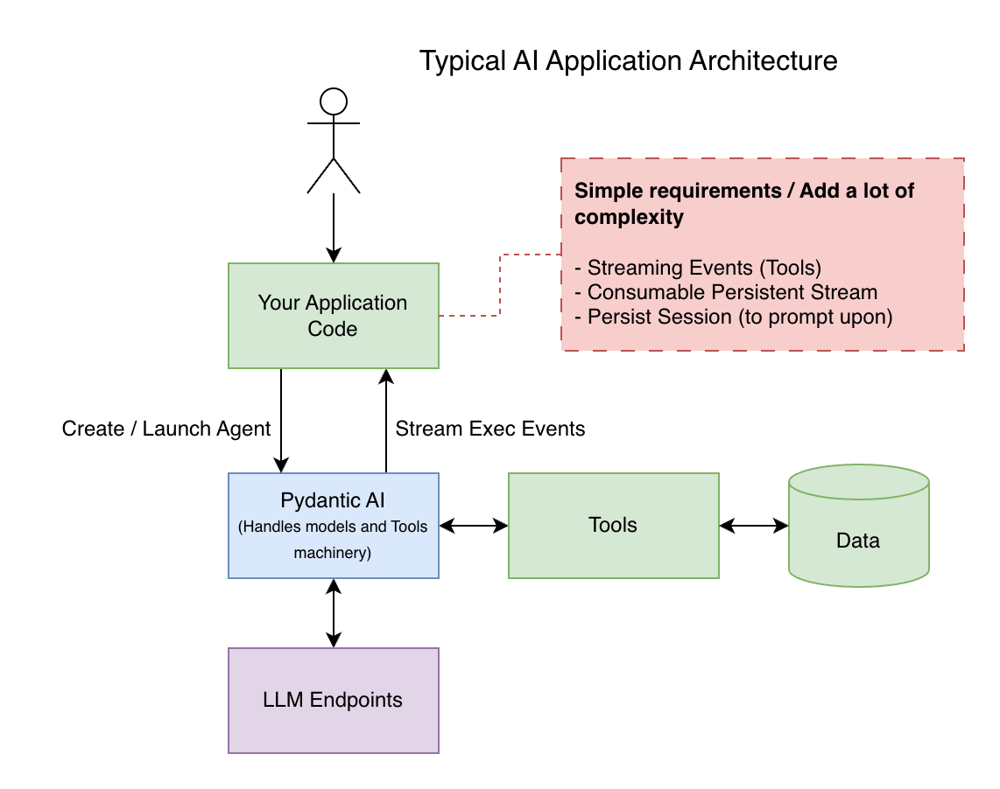

# Opale Agent Stream

## Problem

## Solution

Lightweight library on top of Pydantic-AI that handles :
- Piping agent event to Redis streams for persistency
- Providing basic routines to consume streams and build reliable API endpoints (supporting concurrent readers)
- Long term storage storage routines to `continue` on existing session with no complexity
